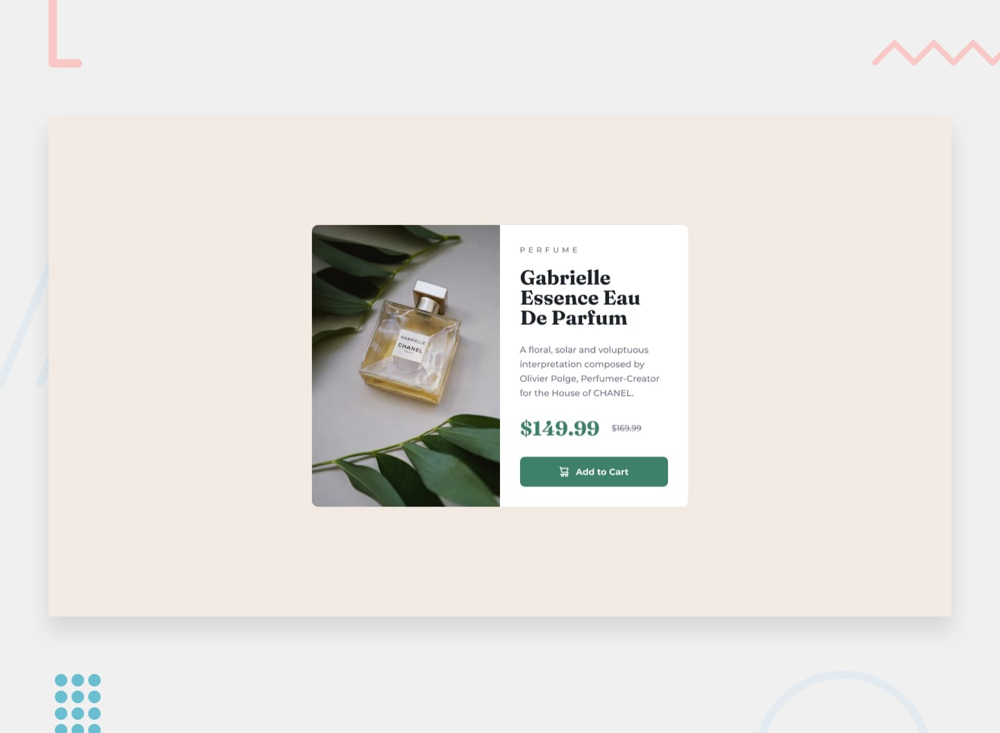

# Frontend Mentor - Product preview card component solution



This is a solution to the [Product preview card component challenge on Frontend Mentor](https://www.frontendmentor.io/challenges/product-preview-card-component-GO7UmttRfa). Frontend Mentor challenges help you improve your coding skills by building realistic projects. 

## Table of contents

- [Overview](#overview)
  - [The challenge](#the-challenge)
  - [Links](#links)
- [My process](#my-process)
  - [Built with](#built-with)
  - [What I learned](#what-i-learned)
- [Author](#author)

## Overview

### The challenge

Users should be able to:

- View the optimal layout depending on their device's screen size
- See hover and focus states for interactive elements

### Links

- Solution URL: [Product Preview Card Component](https://gerardocianciulli.github.io/newbie-product-preview-card-component/)

## My process

### Built with

- Semantic HTML5 markup
- CSS custom properties
- Flexbox
- React
- Typescript

### What I learned

I learned how to pass components as props, with Typescript, which was necessary for passing an SVG as an icon within my button component. This allows me to change the icon to create various types off buttons for future.

```jsx
type ButtonProps = {
    icon: React.ComponentType<{}>
}

const Button = ({ icon: Icon }: ButtonProps) => {
    return (
        <button>
            <Icon />
        </button>)
}
```

## Author

- Portfolio - [Gerardo Cianciulli](https://www.behance.net/gerardo-cianciulli)
- Frontend Mentor - [Gerardo Cianciulli](https://www.frontendmentor.io/profile/GerardoCianciulli)
- Linkedin - [Gerardo Cianciulli](https://www.linkedin.com/in/gerardo-cianciulli/)
# product-preview-card-component
# product-preview-card-component
